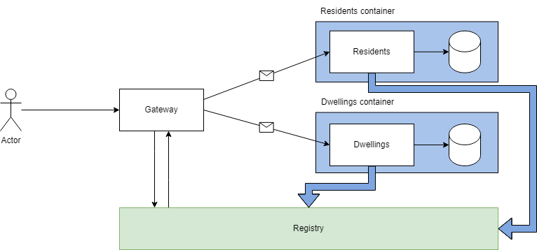

# Security application

Those are a bunch of applications that are meant to integrate a residential building security service.

## The applications

### Registry

This ecossistem will not use redis, kafka, rabbitmq or other types of message queues at this first stage, and so, the applications will have to know eachother by other ways. They will know where to go by calling the registry and passing to it the key of the desired application, then using the `response.host + response.port` returned from the registry service.

The messages are gonna exchange by a TCP connection.

### Gateway

The gateway is the first BFF that consumes the other services and exposes that as an API.

It is open to the internet as a simple webapp. you can send a HTTP request to it and wait till the response comes.

### Dwellings

Part of the application that deals with dwellings of the residents, this help to organize residents into groups and provide them helpful security features.

### Residents

Part of the application that deals with residents, and provide a authentication method for them to access their dwellings security configurations and features.
